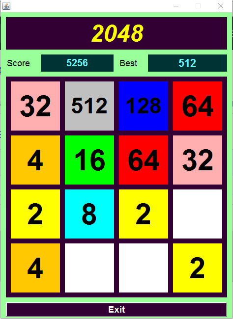

# 2048 for PC

</img>
</img>

Desktop version of famous and very addictive game 2048 written in Java

## Getting Started

Just clone the repository in Netbeans. or downoad zip file and open it in Netbeans.

### Prerequisites

Java jre must be installed in your system to run this application. If not [Download from here](http://www.oracle.com/technetwork/java/javase/downloads/jre8-downloads-2133155.html)

### Installation

Does not need installation. As it is a jar file. Just double click on it to Run.

Note:- Antivirus may find it suspious. As it is executable file. Ignore it.

## Built With

* [Netbeans](https://netbeans.org/downloads/)

## Contributing

Feel free to Frok or commit.

## Authors

* **Shivam Agrawal** - *full work* - [Rising Hope](www.risinghope.tk)

See also the list of [contributors](https://github.com/your/project/contributors) who participated in this project.

## License 
* see [LICENSE](/LICENSE) file
